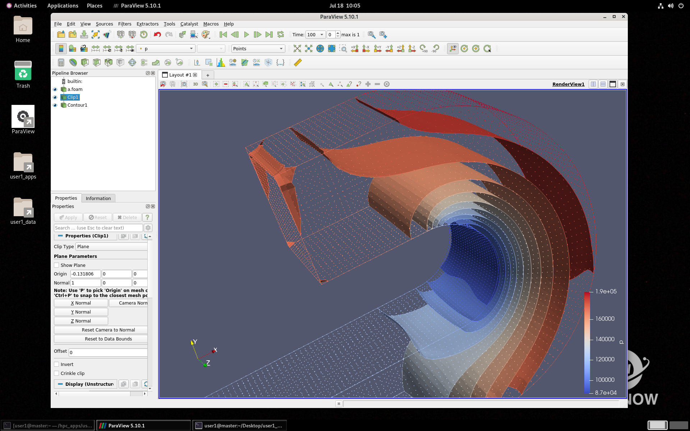

**HPC-NOW, start your HPC journey in the cloud <u>now</u>, with <u>n</u>o <u>o</u>peration <u>w</u>orkload!**

*<u>A full-stack HPC solution in the cloud, for the HPC community.</u>*

**Contributions are highly welcomed and respected. Please see [CONTRIBUTING](./CONTRIBUTING.md).**

- [**1. Project Background**](#1-project-background)
- [**2. Core Components**](#2-core-components)
- [**3. How-To: Build, Install, Run, and Use**](#3-how-to-build-install-run-and-use)
  - [**3.1 Build**](#31-build)
    - [**Prerequisites**](#prerequisites)
    - [**Step 1. Clone this repository**](#step-1-clone-this-repository)
    - [**Step 2. Change the directory**](#step-2-change-the-directory)
    - [**Step 3. Run the build script**](#step-3-run-the-build-script)
  - [**3.2 Install**](#32-install)
    - [**Step 1. Run the installer**](#step-1-run-the-installer)
    - [**Step 2. Initialize the hpcopr**](#step-2-initialize-the-hpcopr)
  - [**3.3 Run**](#33-run)
  - [**3.4 Basic Workflow**](#34-basic-workflow)
  - [**3.5 The Installer Commands**](#35-the-installer-commands)
    - [**General Options(Required)**](#general-optionsrequired)
    - [**Advanced Options(Optional)**](#advanced-optionsoptional)
  - [**3.6 The hpcopr Commands**](#36-the-hpcopr-commands)
    - [**Get-Started**](#get-started)
    - [**Multi-Cluster Management**](#multi-cluster-management)
    - [**Global Management**](#global-management)
    - [**Cluster Initialization**](#cluster-initialization)
    - [**Cluster Management**](#cluster-management)
    - [**Cluster Operation**](#cluster-operation)
    - [**Cluster User Management**](#cluster-user-management)
    - [**Cluster Data Management**](#cluster-data-management)
    - [**Cluster App Management**](#cluster-app-management)
    - [**Cluster Job Management**](#cluster-job-management)
    - [**Others**](#others)
- [**4. Contributing**](#4-contributing)

# **1. Project Background**

Cloud High-Performance Computing - **Cloud HPC**, differs from on-premise HPC significantly. Cloud service brings high scalability and flexibility to High-Performance Computing. However, most HPC users are not familiar with building and maintaining HPC services in the cloud. The technical barrier of cloud computing is very high to researchers, engineers, and developers in different scientific and engineering domains, e.g. energy, chemistry, physics, materials, bioscience. 

In order to make it super easy to start and manage HPC workloads in the cloud, we have been developing this project: HPC-NOW. **NOW** stands for:

- Start HPC workloads in the cloud **NOW**, immediately, in minutes.
- Manage HPC workloads with (almost) **N**o **O**peration **W**orkload.

Currently, the HPC-NOW platform supports 7 popular cloud platforms, shown as below:

- [Alibaba Cloud](https://www.alibabacloud.com/en), HPC-NOW Internal Code: CLOUD_A
- [Tencent Cloud](https://www.tencentcloud.com/), HPC-NOW Internal Code: CLOUD_B
- [Amazon Web Services](https://aws.amazon.com/), HPC-NOW Internal Code: CLOUD_C
- [Huawei Cloud](https://www.huaweicloud.com/), HPC-NOW Internal Code: CLOUD_D
- [Baidu BCE](https://cloud.baidu.com/), HPC-NOW Internal Code: CLOUD_E
- [Microsoft Azure](https://azure.microsoft.com/en-us/), HPC-NOW Internal Code: CLOUD_F
- [Google Cloud Platform](https://cloud.google.com/), HPC-NOW Internal Code: CLOUD_G

# **2. Core Components**

Thanks to [Terraform](http://www.terraform.io) and [openTofu](https://github.com/opentofu/opentofu) for making it possible to orchestrate cloud resources in a unified and simple way.

In this project, we are developing several components:

-  **installer**  : HPC-NOW service installer. It requires **temporary** administrator or root privilege to run [why?](#35-the-installer-commands).
-  **hpcopr**     : HPC Operator. The main component that manages the HPC clusters, users, jobs, data, monitoring, usage, etc.
-  **now-crypto** : An independent cryptography module (**AES-128-ECB-PKCS#7**) that encrypts and decrypts the files containing sensitive information.
-  **hpcmgr**    : A utility running in every cluster's master node to communicate with the operator.
-  **infra-as-code** : Infrastructure codes in HCL format.
-  **scripts**    : Shell scripts to initialize the clusters, install applications, etc.

The high-level architecture of this project is:

# **3. How-To: Build, Install, Run, and Use**

The HPC-NOW platform is very easy to build, run, and use. It is also cross-platform, which means you can run the HPC-NOW on Microsoft Windows, GNU/Linux (with APT, DNF or YUM), and macOS (Darwin). 

**Note 1**: Currently only **x86_64** platform is supported. If you are using other cpu platforms, please let us know.

**Note 2**: Instead of compiling/building from the source code, you can download pre-built executables/binaries from the release of this repository. In this case, the dev/build tools (`git`, `gcc`, `clang`, or `mingw`) are **NOT** needed.

**Note 3**: The HPC-NOW relies on some fundamental system utilities. In most cases, these utilities have been included in the OS distros. See the list below. If you are not sure whether the utilities are installed or not, please run the commands in a terminal/command prompt window.

- **Microsoft Windows**: `curl` `tar`
- **GNU/Linux Distros**: `curl` `tar` `unzip`
- **macOS (Darwin)**   : `curl` `tar` `unzip`

*If the utility `curl` is not pre-installed, please manually install it from the [official site](https://curl.se/download.html), and add the PATH to the system environment variables. Usually, `tar` and `unzip` are pre-installed.*

## **3.1 Build**

### **Prerequisites** 

- Use [git](https://git-scm.com/) for code management.
- Use a standard C compiler. We recommend:
  -  [gcc](https://gcc.gnu.org/) for **GNU/Linux distros**
  -  [clang](https://clang.llvm.org/) for **macOS (Darwin)**
  -  [mingw](https://sourceforge.net/projects/mingw/) for **Microsoft Windows**.

### **Step 1. Clone this repository** 

`git clone https://github.com/zhenrong-wang/hpc-now`

If your connectivity to github is not stable, you can also try to clone from gitee:

`git clone https://gitee.com/zhenrong-wang/hpc-now`

### **Step 2. Change the directory** 

`cd hpc-now`

### **Step 3. Run the build script** 

- For **Microsoft Windows**: `.\make_windows.bat build`
- For **GNU/Linux Distro** : `./make_linux.sh build`
- For **macOS (Darwin)**   : `./make_darwin.sh build`

If everything goes well, the binaries will be built to the `build` folder.

## **3.2 Install**

### **Step 1. Run the installer**

**Temporary** Administrator or root privilege is required to run the installer [why?](#35-the-installer-commands).

- For **Microsoft Windows** : 
    
    Step 1. Open a Command Prompt **as Administrator**: 

        - Type 'cmd' in the search box
        - Right click on the icon of the Command Prompt
        - Select 'Run as Administrator'

    Step 2. Change direcroty to the `build` folder: 
    
    Suppose your local repo path is `c:\users\public\hpc-now`, then the command should be:
    
    `cd c:\users\public\hpc-now\build`

    Step 3. Run the command below:

    Suppose your installer version code is 0.2.1, hpcopr version code is 0.2.1, then the command should be:

    `.\installer-win-0.2.1.exe install --hloc hpcopr-win-0.2.1.exe --cloc now-crypto-win.exe`

- For **GNU/Linux Distros** : 

    Suppose your installer version code is 0.2.1, hpcopr version code is 0.2.1, then the command should be:

    `sudo ./installer-lin-0.2.1.exe install --hloc hpcopr-lin-0.2.1.exe --cloc now-crypto-lin.exe`

- For **macOS(Darwin)**:

    Suppose your installer version code is 0.2.1, hpcopr version code is 0.2.1, then the command should be:

    `sudo ./installer-dwn-0.2.1.exe install --hloc hpcopr-dwn-0.2.1.exe --cloc now-crypto-dwn.exe`

**IMPORTANT**: Please replace the sample version code `0.2.1` with the real code of your own build.

**IMPORTANT**: Please keep the window open for the next step.

### **Step 2. Initialize the hpcopr**

The `hpcopr.exe` is designed to be executed by the dedicated system OS user named `hpc-now`, which has been created by the installer in the last step.

In order to run the `hpcopr.exe`, you'll need to set a password and switch to that user. See the stpes below:

- For **Microsoft Windows**:

    - Set a password for the user 'hpc-now' : `net user hpc-now YOUR_COMPLEX_PASSWORD`
    - Run a new cmd window as 'hpc-now'     : `runas /savecred /user:mymachine\hpc-now cmd`
    - Run the main program 'hpcopr.exe'     : `hpcopr envcheck`

- For **GNU/Linux Distros**:

    - Set a password for the user 'hpc-now' : `sudo passwd hpc-now`
    - Switch to the user 'hpc-now'          : `su hpc-now`
    - Run the main program 'hpcopr.exe'     : `hpcopr envcheck`

- For **macOS(Darwin)**:

    - Set a password for the user 'hpc-now' : `sudo dscl . -passwd /Users/hpc-now YOUR_COMPLEX_PASSWORD`
    - Switch to the user 'hpc-now'          : `su hpc-now`
    - Run the main program 'hpcopr.exe'     : `hpcopr envcheck`

Several extra packages (around 500 MB) will be download and installed. This process may needs minutes (depending on your local network connectivity).

**NOTE:** For UNIX-like OS, it is not necessary to set a password for 'hpc-now' and switch to it in the terminal. You can just run `hpcopr.exe` with `sudo -u hpc-now` prefix. e.g.:

`sudo -u hpc-now hpcopr envcheck`

**NOTE:** This method is only valid for **sudoers**.

## **3.3 Run**

The `hpcopr` is the main CLI for you to run. Please see the description above.

If you'd like to update/uninstall the HPC-NOW services, you will need to run the `installer` with `sudo`(for UNIX-like OS) or **as administrator**(for Windows).

## **3.4 Basic Workflow**

In order to use and manage HPC in the cloud with HPC-NOW, please follow the workflow:

- Import a cloud credential - a keypair or key file (**`hpcopr new-cluster ...`**) --> 
- Initialize a new cluster (**`hpcopr init ...`**) --> 
- Deploy an application (**`hpcopr appman ...`**) -->
- Upload your data (**`hpcopr dataman ...`**) -->
- Connect to your cluster (**`hpcopr ssh ...`** OR **`hpcopr rdp ...`**) -->
- Start your HPC work (**`hpcopr jobman ...`**) -->
- Waiting for the job to be done - **may be minutes, hours, or days ...**
- Export your HPC data to local or other places (**`hpcopr dataman ...`**) -->
- Hibernate the cluster (*optional*, **`hpcopr sleep ...`**) -->
- Destroy the cloud cluster (**`hpcopr destroy ...`**) -->
- Remove the cloud credentials (optional, **`hpcopr remove ...`**)

*An example of an HPC-NOW cluster running Paraview*

## **3.5 The Installer Commands**

The **`installer`** is designed to manage the installation/update/removal of the HPC-NOW services. It needs temporary administrator privilege to:

- Add/delete the dedicated system user 'hpc-now'
- Change the ownership and/or permissions of the key working directories
- Use system-level package manager to install packages such as wget, zip/unzip, in case the packages are absent

**We follow the least privilege principle**. Please check the [source code directory of installer](./installer/).

**USAGE**: 

- `sudo ./installer GENERAL_OPTION(required) ADVANCED_OPTIONS(optional)` for **macOS(Darwin)** and **GNU/Linux** sudoers
- `.\installer GENERAL_OPTION(required) ADVANCED_OPTIONS(optional)` for **Microsoft Windows** Administrators

### **General Options(Required)**

- `install`    Install the HPC-NOW services and components.
- `update`     Update the HPC-NOW services and components.
- `uninstall`  Uninstall the HPC-NOW services completely. **CAUTION! You must destroy/remove all the clusters managed in current device before running this command! Otherwise, out-of-manage cloud resource may occur!**
- `help`       Read the help doc for `installer`.
- `setpass`    Set/rotate/change/update the operator's password.
- `version`    Display the version of the `installer`, not the `hpcopr`.
- `verlist`    List out all the available versions provided in the public repository.

### **Advanced Options(Optional)**

- `--accept`    Automatically accept the MIT License terms of this software.
- `--pass PASSWORD`  Specify the operator's crypto password.
- `--hloc LOCATION`  The location (an URL or a valid local path) of the `hpcopr` CLI.
- `--cloc LOCATION`  The location (an URL or a valid local path) of the `now-crypto` binary.
- `--hver VERSION` Specify a version of the `hpcopr` CLI, default: latest version.
- `--rdp` **Recommend!** Install the RDP client for GNU/Linux or macOS(Darwin).

**Examples**

- `sudo ./installer install --rdp`
- `sudo ./installer install --hloc ./hpcopr.exe --cloc ./now-crypto.exe --accept`
- `sudo ./installer uninstall`
- `sudo ./installer update --hloc ./hpcopr.exe --accpet`

## **3.6 The hpcopr Commands**

The **`hpcopr`** is a very powerful Command Line Interface (CLI) for you to use.

**USAGE**: `hpcopr [-b] CMD_NAME CMD_FLAG ... [CMD_KEYWORD1 CMD_KEY_STRING1] ...`

- **`-b`** : An optional flag to enter the batch mode and to skip all the interactions.
- **`CMD_NAME`**: see all the command names below
- **`CMD_FLAG`**: single value, such as `--force`，`--all`
- **`CMD_KEYWORD`**: key-value pair, such as `-c myFirstCluster`

**Examples:** 

- `hpcopr new-cluster`
- `hpcopr ssh -u user1 -c my_first_cluster`
- `hpcopr -b rdp -u user2`

**CMD_NAME LIST**:

### **Get-Started**

- `envcheck`     Quickly check the running environment.

### **Multi-Cluster Management**

- `new-cluster`  Create a new cluster to initialize.
- `ls-clusters`  List all the current clusters.
- `switch`       Switch to a cluster in the registry to operate.
- `glance`       View all the clusters or a target cluster.
- `refresh`      Refresh a cluster without changing the resources.
- `export`       Export a cluster to another hpcopr client. Optional params:
- `import`       Import a cluster to the current hpcopr client.
- `remove`       Completely remove a cluster from the OS and registry.
- `exit-current` Exit the current cluster.

### **Global Management**

- `help`         Show this page and the information here.
- `usage`        View and/or export the usage history.
- `monman`       Get, filter, and extract cluster monitoring data.
- `history`      View and/or export the operation log.
- `syserr`       View and/or export the system cmd errors.
- `ssh`          SSH to the master node of a cluster.
- `rdp`          Connect to the cluster's desktop environment.

*Advanced - For developers:*

- `decrypt`      **VERY RISKY!!!** Decrypt sensitive files of a cluster list or all.
- `encrypt`      Encrypt sensitive files of a cluster list or all.
- `set-tf`       Set the running configurations for openTofu or terraform
- `configloc`    Configure the locations for the terraform binaries, providers, IaC templates and shell scripts.
- `showloc`      Show the current configured locations.
- `showmd5`      Show the md5sum values of core components.
- `resetloc`     Reset to the default locations.

### **Cluster Initialization**

- `rotate-key`  *Rotate* a new keypair for an existing cluster. The new keypair should be valid and comes from the same cloud vendor.
- `get-conf`    Get the default configuration file to edit and build a customized HPC cluster later (using the 'init' command).
- `edit-conf`   Edit and save the default configuration file *before* init.
- `rm-conf`     Remove the configuration file *before* init.
- `init`        Initialize a new cluster. If the configuration file is absent, the command will generate a default configuration file.
- `rebuild`     Rebuild the nodes *without* destroying the cluster's storage.

### **Cluster Management**

- `vault`        Check the sensitive information of the current cluster.
- `graph`        Display the cluster map including all the nodes and status.
- `viewlog`      View the operation log of the current cluster.

### **Cluster Operation**

- `delc`         Delete specified compute nodes. You must specify how many to be added, or use `--nn all`
- `addc`         Add compute nodes to current cluster. You must specify how many to be added by `--nn NUM`.
- `shutdownc`    Shutdown specified compute nodes. Similar to 'delc', you can specify to shut down all or part of the compute nodes by the param `--nn NUM` or `--nn all`.
- `turnonc`      Turn on specified compute nodes. Similar to 'delc', you can specify to turn on all or part of the compute nodes by the parameter `--nn NUM` or `--nn all`. 
- `reconfc`      Reconfigure all the compute nodes.
- `reconfm`      Reconfigure the master node.
- `sleep`        Turn off all the nodes (management and compute) of the cluster.
- `wakeup`       Wake up the cluster nodes.
- `nfsup`        Increase the cluster’s NFS shared volume (in GB, only for Huaweicloud, Google Cloud Platform, and Microsoft Azure).
- `destroy`      **DESTROY** the whole cluster - including all the resources & data.
- `payment`      Switch the payment method between on-demand and monthly (not applicable for AWS, Google Cloud Platform, or Microsoft Azure).

### **Cluster User Management**

**Usage:** `hpcopr userman --ucmd USER_CMD [ KEY_WORD1 KEY_STRING1 ] ...`

*The cluster must be in running state (minimal or all).* 

    --ucmd list      List all the current cluster users.
    --ucmd add       Add a user to the cluster. By default, added users are enabled.
    --ucmd delete    Delete a user from the cluster.
    --ucmd enable    Enable a *disabled* user. Enabled users can run HPC workloads.
    --ucmd disable   Disable a user. Disabled users still can access the cluster.
    --ucmd passwd    Change user's password.

### **Cluster Data Management**

**Usage:** `hpcopr dataman CMD_FLAG... [ KEY_WORD1 KEY_STRING1 ] ...`

**General Flags:**     -r, -rf, --recursive, --force, -f.

    -s SOURCE_PATH    Source path of the binary operations. i.e. cp
    -d DEST_PATH      Destination path of binary operations. i.e. cp
    -t TARGET_PATH    Target path of unary operations. i.e. ls

**Bucket Operations** 

*Transfer and manage data with the bucket.*

    --dcmd put         Upload a local file or folder to the bucket path.
    --dcmd get         Download a bucket object(file or folder) to the local path.
    --dcmd copy        Copy a bucket object to another folder/path.
    --dcmd list        Show the object list of a specified folder/path.
    --dcmd delete      Delete an object (file or folder) of the bucket.
    --dcmd move        Move an existed object (file or folder) in the bucket.

**Example:** `hpcopr dataman --dcmd put -s ./foo -d /foo -u user1`

**Direct Operations** 

*Transfer and manage data in the cluster storage.*

*The cluster must be in running state (minimal or all).*

    --dcmd cp          Remote copy between local and the cluster storage.
    --dcmd mv          Move the remote files/folders in the cluster storage.
    --dcmd ls          List the files/folders in the cluster storage.
    --dcmd rm          Remove the files/folders in the cluster storage.
    --dcmd mkdir       Make a directory in the cluster storage.
    --dcmd cat         Print out a remote plain text file.
    --dcmd more        Read a remote file.
    --dcmd less        Read a remote file.
    --dcmd tail        Streaming out a remote file dynamically.
    --dcmd rput        Upload a *remote* file or folder to the bucket path.
    --dcmd rget        Download a bucket object(file or folder) to the *remote* path.

        @h/ to specify the $HOME prefix of the cluster.
        @d/ to specify the /hpc_data/user_data prefix.
        @a/ to specify the /hpc_apps/ prefix, only for root or user1.
        @p/ to specify the public folder prefix ( INSECURE !).
        @R/ to specify the / prefix, only for root or user1.
        @t/ to specify the /tmp prefix.

**Example:** `hpcopr dataman --dcmd cp -s ~/foo/ -d @h/foo -r -u user1`

### **Cluster App Management**

**Usage:** `hpcopr appman --acmd APP_CMD CMD_FLAG [ KEY_WORD1 KEY_STRING1 ] ...`

*The cluster must be in running state (minimal or all).*

`-u USERNAME`    A valid user name. Use 'root' for all users. Admin or Operator role is required for root.

    --acmd store         List out the apps in store.
    --acmd avail         List out all the installed apps.
    --acmd check         Check whether an app is available.
    --acmd install       Install an app to all users or a specified user.
    --acmd build         Compile and build an app to all users or a specified user.
    --acmd remove        Remove an app from the cluster.
    --acmd update-config Update the locations for scripts and pacakge repository
    --acmd show-config   Display the locations for scripts and pacakge repository

### **Cluster Job Management**

**Usage:** `hpcopr jobman --jcmd APP_CMD [ KEY_WORD1 KEY_STRING1 ] ...`

*The cluster must be in running state (minimal or all).*

`-u USERNAME`      A valid user name. The root user CANNOT submit jobs.

    --jcmd submit    Submit a job to the cluster.
    --jcmd list      List out all the jobs.
    --jcmd cancel    Cancel a job with specified ID

### **Others**

- `about`        About this software and HPC-NOW project.
- `version`      Display the version info.
- `license`      Read the terms of the MIT License
- `repair`       Try to repair the hpcopr core components.

For more information, please refer to Docs/UserManual-EN.pdf.

The most detailed help info can be found by the command `hpcopr help`. We are also considering writing a standard mannual for `hpcopr`. If you are interested, please let us know.

# **4. Contributing**

Please see the [contributing guide](./CONTRIBUTING.md) .

Also, please feel free to mailto: 

- [zhenrongwang@live.com](mailto:zhenrongwang@live.com)
- [wangzhenrong@hpc-now](mailto:wangzhenrong@hpc-now)

# **5. Appendix: HPC-NOW Directories**

The hpc-now service manages 2 top-level directories and several subdirectories on your device and OS. Here is the architecture:

+- **BINARY_ROOT/** - **Windows: C:\\hpc-now\\** | **GNU/Linux: /home/hpc-now/** | **macOS(Darwin) /Users/hpc-now/**\
&emsp;&emsp;+- **hpcopr** executable\
&emsp;&emsp;+- **utils/**\
&emsp;&emsp;&emsp;&emsp;+- **now-crypto-aes** executable\
&emsp;&emsp;&emsp;&emsp;+- **terraform/tofu** executable\
&emsp;&emsp;&emsp;&emsp;+- cloud utilities\
+- **RUNNING_ROOT/** - **Windows: C:\\ProgramData\\hpc-now\\** | **GNU/Linux: /usr/.hpc-now/** | **macOS(Darwin) /Applications/.hpc-now/**\
&emsp;&emsp;+- log_trashbin.txt\
&emsp;&emsp;+- .now_crypto_seed.lock\
&emsp;&emsp;+- .now-cluster-usage.log\
&emsp;&emsp;+- system_command_error.log\
&emsp;&emsp;+- system_command_error.log.tmp\
&emsp;&emsp;+- .now-cluster-operation.log\
&emsp;&emsp;+- .now-cluster-operation.log.tmp\
&emsp;&emsp;+- **.tmp/** - *Temporary files*\
&emsp;&emsp;+- **.now-ssh/** - *SSH keys*\
&emsp;&emsp;&emsp;&emsp;+- now-cluster-login.tmp\
&emsp;&emsp;&emsp;&emsp;+- now-cluster-login.pub\
&emsp;&emsp;&emsp;&emsp;+- .CLUSTER_NAME/\
&emsp;&emsp;&emsp;&emsp;&emsp;&emsp;+- USER_PRIVATE_KEYS.tmp\
&emsp;&emsp;+- **.etc/** - *General configuration files*\
&emsp;&emsp;&emsp;&emsp;+- .all_clusters.dat\
&emsp;&emsp;&emsp;&emsp;+- current_cluster.dat\
&emsp;&emsp;&emsp;&emsp;+- google_check.dat\
&emsp;&emsp;&emsp;&emsp;+- locations.conf\
&emsp;&emsp;&emsp;&emsp;+- md5values.conf\
&emsp;&emsp;&emsp;&emsp;+- tf_running.conf\
&emsp;&emsp;+- **.destroyed/** - *Files of destroyed clusters*\
&emsp;&emsp;+- **workdir/** - *Working directories for all clusters*\
&emsp;&emsp;&emsp;&emsp;+- CLUSTER_NAME/\
&emsp;&emsp;&emsp;&emsp;&emsp;&emsp;+- log/\
&emsp;&emsp;&emsp;&emsp;&emsp;&emsp;+- stack/\
&emsp;&emsp;&emsp;&emsp;&emsp;&emsp;+- conf/\
&emsp;&emsp;&emsp;&emsp;&emsp;&emsp;+- vault/\
&emsp;&emsp;+- **mon_data/** - *Monitoring data of all clusters*\

*All the directories and files except the .now_crypto_seed.lock are set to be readable, writable, and executable only by the system user hpc-now.*